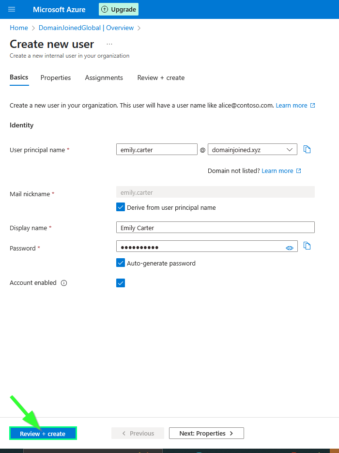
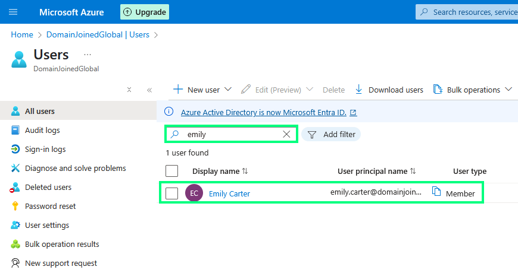
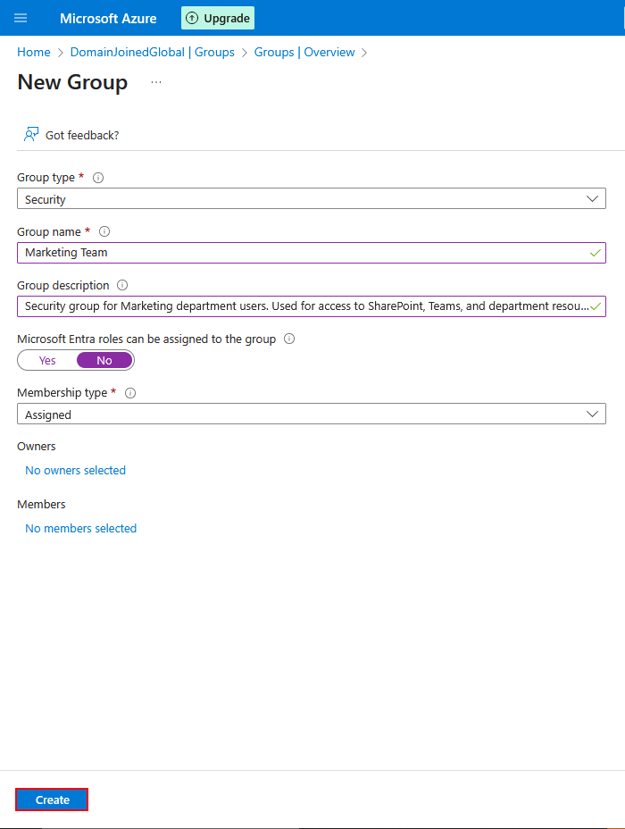
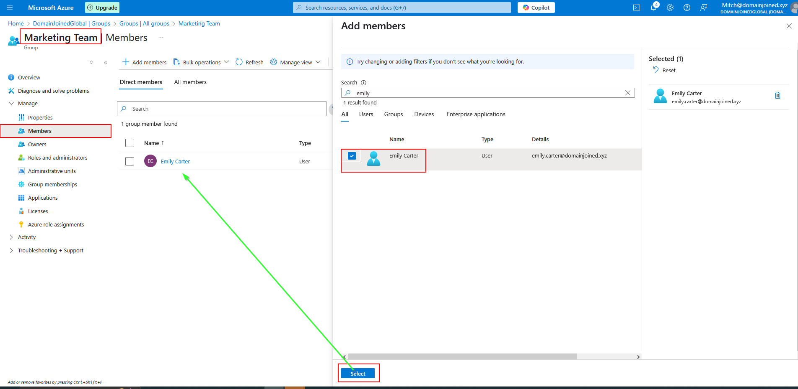
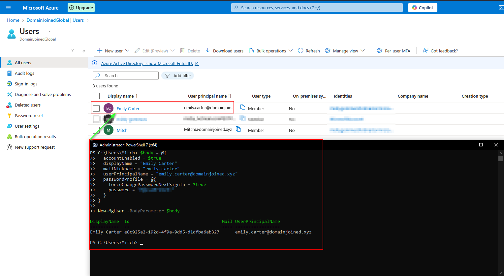
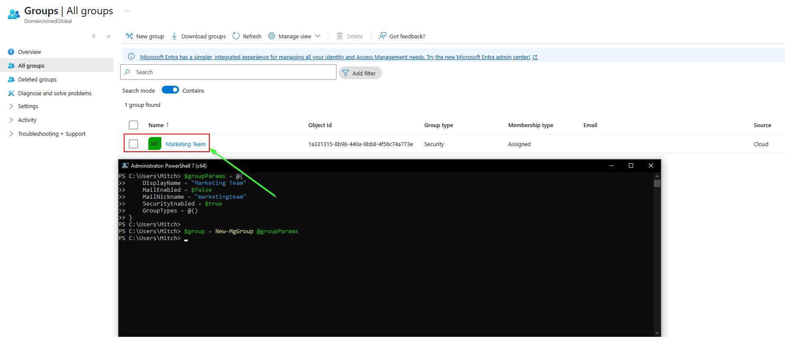
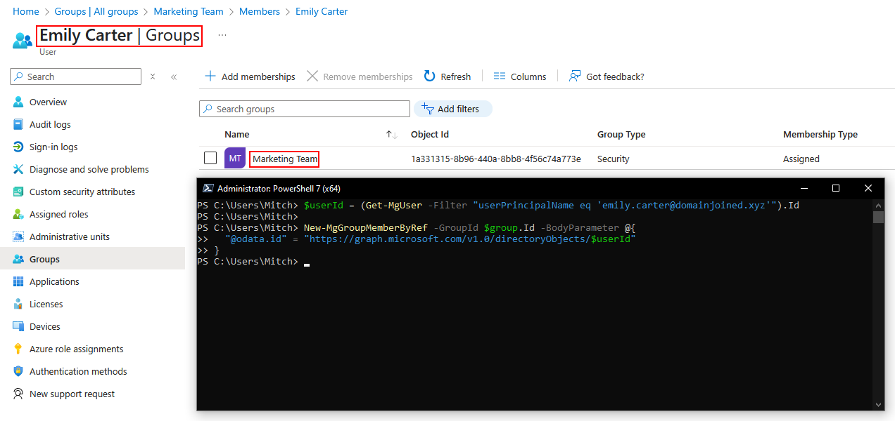

# 🎫 Ticket SD-1023 – New User Account Creation

## 📘 Table of Contents

- [🖱️ GUI (Azure Portal)](#full-process--azure-portal-gui)
- [💻 PowerShell (Step-by-Step)](#full-process--powershell-step-by-step)
- [⚙️ Script Automation](#full-process--powershell-script-automation)
- [✅ Resolution](#resolution)


## 📄 Request Summary
HR submitted a request to onboard a new employee, **Emily Carter**, who is joining the **Marketing** department.

## 📝 Requested Actions
- Create Microsoft Entra ID user account
- Add user to "Marketing Team" security group

---

## 🖱️ Full Process – Azure Portal (GUI)

### 1. Create User
- Navigate to **Microsoft Entra ID > Users > + New User**
- Fill in user details for Emily Carter
- Leave account enabled and set "Force password change at next login"
- Click **Create**




---

### 2. Create and Assign Group
- Go to **Microsoft Entra ID > Groups > + New Group**
- Create a **Security group** named `Marketing Team`
- Set membership type to **Assigned**
- Add Emily Carter as a member




---

## 💻 Full Process – PowerShell (Step-by-Step)

### 1. Create User (if applicable via script)
```powershell
New-MgUser -BodyParameter @{
  accountEnabled = $true
  displayName = "Emily Carter"
  mailNickname = "emily.carter"
  userPrincipalName = "emily.carter@domainjoined.xyz"
  passwordProfile = @{
    forceChangePasswordNextSignIn = $true
    password = "P@ssw0rd123!"
  }
}
```


### 2. Create Group
```powershell
$groupParams = @{
    DisplayName     = "Marketing Team"
    MailEnabled     = $false
    MailNickname    = "marketingteam"
    SecurityEnabled = $true
    GroupTypes      = @()
}

$group = New-MgGroup @groupParams
```



### 3. Add to Group
```powershell
$group = Get-MgGroup -Filter "displayName eq 'Marketing Team'"
$userId = (Get-MgUser -Filter "userPrincipalName eq 'emily.carter@domainjoined.xyz'").Id

New-MgGroupMemberByRef -GroupId $group.Id -BodyParameter @{
  "@odata.id" = "https://graph.microsoft.com/v1.0/directoryObjects/$userId"
}
```



---

## ⚙️ Full Process – PowerShell Script Automation

Once tested manually, the onboarding can be performed using automation scripts:

```powershell
.\scripts\create-user.ps1
.\scripts\add-user-to-group.ps1
```

Each script is modular and reusable for future onboarding scenarios. This reflects how most enterprise environments automate identity lifecycle tasks using Entra ID.

---

## ✅ Resolution
Emily Carter has been successfully onboarded with an active user account and added to the Marketing Team group.

🗂️ Ticket Closed.
