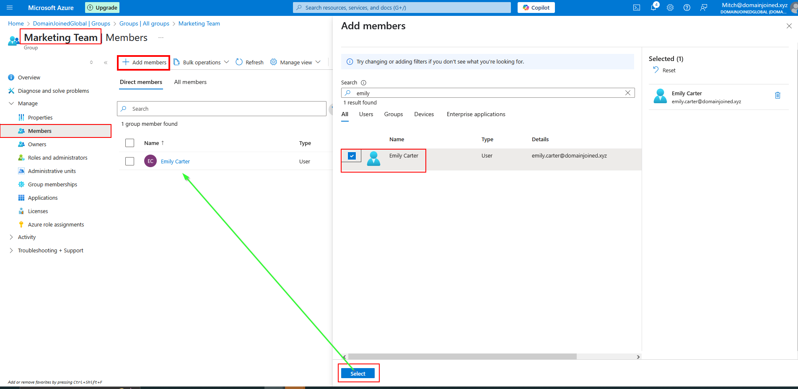

# 🎫 Ticket ID: SD-1023 - New User Account Creation

## 🏢 Scenario

It’s Monday morning at **DomainJoinedGlobal**, and the IT support team has just received a ticket from HR via the internal helpdesk portal.  

The request is to **onboard a new Marketing team member, Emily Carter**, who starts next Monday. HR has included all the necessary details, and the hiring manager has requested access to be ready by the end of the day.  

As the assigned support engineer, it’s your responsibility to ensure that Emily’s account is created, assigned the appropriate Microsoft 365 license, added to the correct group, and that all steps are properly documented for auditing purposes.


<details>
  <summary>📋 View Employee Details</summary>

  - **Full Name:** Emily Carter  
  - **Job Title:** Marketing Analyst  
  - **Department:** Marketing  
  - **Start Date:** 2025-06-03  
  - **Username:** emily.carter  
  - **Email:** emily.carter@domainjoined.xyz  
  - **Manager:** John Sanders  
  - **Group Membership:** Marketing Team  

</details>

---

## 🎯 Objective
- Create a Microsoft Entra ID user for Emily Carter
- Add her to the *Marketing Team* security group
- Assign her a Microsoft 365 Business Standard license
- Prepare a welcome email with login details

---

## 🛠️ Technologies Used
- **Microsoft Entra ID (Azure Active Directory)**
- **Azure Portal (GUI)**
- **PowerShell**
- **Microsoft Graph PowerShell SDK**
- **Microsoft 365 Licensing**

---

## 🖥️ Method 1: GUI
### Guided Steps:

<details>
  <summary>📸 Step 1: Create Entra ID User</summary>

  - Go to **Microsoft Entra ID > Users > + New User**
  - **[Basic Tab]** Fill in user details for Emily Carter
  - Enable account and require password change on first login
  - **[Properties Tab]** Add John Sanders as marketing manager
  - **[Review + Create Tab]** Verify all provided employee details have been filled in
  - Click **Create**

  


</details>


<details>
  <summary>📸 Step 2: Add User to Existing Group</summary>

  - Navigate to **Microsoft Entra ID > Groups**
  - Search for the group: `Marketing Team`
  - Click on the group name to open its settings
  - Go to **Members** tab > click **+ Add Members**
  - Search for **Emily Carter**, select her, then click **Select**
  - Confirm the addition by clicking **Add**

  
</details>


<details>
  <summary>📸 Step 3: Assign Microsoft 365 License</summary>

  - Go to **https://admin.microsoft.com**
  - Navigate to **Billing > Licenses**
  - Click on **Microsoft 365 Business Standard**
  - Click **Assign licenses**
  - Select **Emily Carter** and click **Assign**

  After assigning the license, you will be prompted to send a standard microsoft email to the user and you can add a custom message to it.

  

  > Note: Assigning licenses via the Billing section offers the option to immediately email login credentials, which is useful in onboarding scenarios.

  The system-generated sign-in email was successfully delivered to Emily's mailbox.

  To ensure consistency, a [manual welcome email template](./assets/welcome-email-template.md) is provided to simulate what would be sent in a production environment.

</details>


---

## 💻 Method 2: PowerShell / Script Automation
### Script Command:
```powershell
.\scripts\azure_user_creation_script.ps1
.\scripts\azure_group_assignment.ps1
.\scripts\azure_license_assignment.ps1
```

### Script Execution:

<details>
  <summary>📸 User Creation</summary>

  

</details>

<details>
  <summary>📸 Assign to group</summary>

  

</details>

<details>
  <summary>📸 Assign License</summary>

  

</details>


---

## Summary

Emily Carter has been successfully onboarded into the DomainJoinedGlobal environment.  
Her account was created in Microsoft Entra ID, added to the appropriate security group (`Marketing Team`), and assigned a Microsoft 365 Business Standard license.  

This setup ensures that she has access to email, collaboration tools, and all necessary marketing resources from day one. A customized welcome email was also prepared to guide her through the login process.

This task reflects a typical first-line service desk operation, combining both GUI and PowerShell methods for flexibility and documentation.

---

## 📂 Project Files
- [`welcome-email-template`](.\assets/welcome-email-template.md)
- [`azure_user_creation_script.ps1`](.\scripts\azure_user_creation_script.ps1)
- [`azure_group_assignment.ps1`](.\scripts\azure_group_assignment.ps1)
- [`azure_license_assignment.ps1`](.\scripts\azure_license_assignment.ps1)
- [`azure_user_template-emily-carter.csv`](.\assets\azure_user_template-emily-carter.csv)


