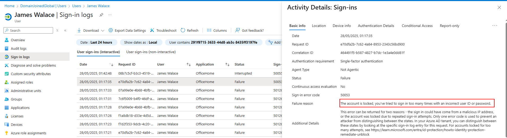
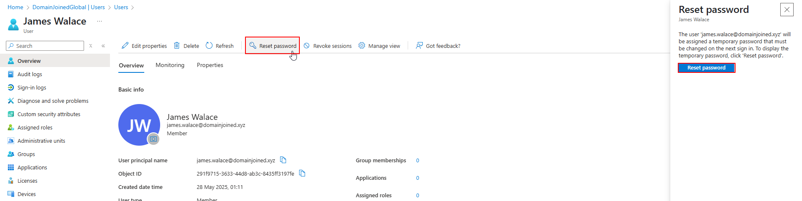
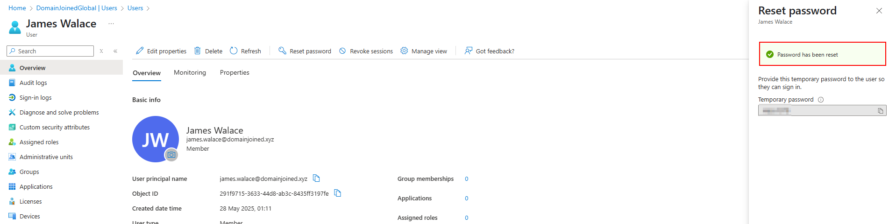
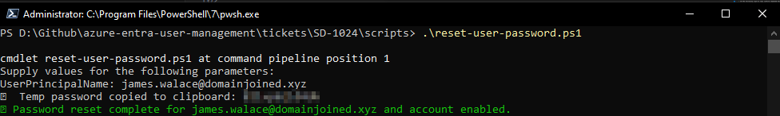

# 🔷 Ticket ID: SD-1024 - Password Reset for Locked-Out User 🔷

## 🏢 Scenario

It’s mid-morning at **DomainJoinedGlobal**, and a ticket comes into the helpdesk from the Finance department.  

**James Walace**, a team member, reports he’s been locked out of his account after several failed password attempts. He needs immediate access to finish a time-sensitive financial report in OneDrive.  

You're the first-line support engineer assigned to this ticket. Your job is to verify his status, reset his password, and ensure he can log back in successfully.

<details>
  <summary>📋 View Employee Details</summary>

  - **Full Name:** James Walace  
  - **Job Title:** Financial Analyst  
  - **Department:** Finance  
  - **Email:** james.walace@domainjoined.xyz  
  - **Username:** james.walace  
  - **Manager:** Laura Simmons  

</details>

---

## 🎯 Objective

- Locate and verify the locked-out user account  
- Reset the user’s password  
- Ensure “force password change at next sign-in” is enabled  
- Send (or simulate) sign-in information to the user

---

## 🛠️ Technologies Used

- Microsoft Entra ID (Azure Active Directory)  
- Azure Portal (GUI)  
- PowerShell  
- Microsoft Graph PowerShell SDK  
- Microsoft 365 Admin Center

---

## 🖥️ Method 1: GUI

<details>
  <summary>📸 Step 1: Locate and Unlock User</summary>

  - Go to **Microsoft Entra ID > Users**
  - Search for **James Walace** and open his profile
  - Go to Sign-in Logs and confirm lockout status/reason

  
</details>

<details>
  <summary>📸 Step 2: Reset Password</summary>

  - Go back to **Overview**, click **Reset password** button.
  - A popup will appear which explains that he will be assigned a temporary password that must be changed at next sign in.
  - Click **Reset Password**

  
</details>

<details>
  <summary>📸 Step 3: Copy and Deliver Password</summary>

  - After clicking **Reset password**, a confirmation message appears showing the system-generated temporary password.
  - Click **Copy password** and securely deliver it to the user (e.g., via phone call, in-person, or secure chat).
  - Ensure the user knows they’ll be prompted to change it at next sign-in.

  > 📩 While Entra ID does not offer an automatic “send password” option, admins typically use a standardized email or secure messaging method.

  A sample notification message is available here:  
  [`password-reset-template.md`](./assets/password-reset-template.md)

  
</details>


---

## 💻 Method 2: PowerShell / Script Automation

### Script Command:
```powershell
.\scripts\reset-user-password.ps1
```

### Script Execution:

<details>
  <summary>📸 Execution Output</summary>

  
</details>

✅ The PowerShell script resets James’s password, enforces password change, and optionally logs the action.

---

## Summary

James Walace was successfully assisted within the **DomainJoinedGlobal** environment.  
His password was reset, and he was prompted to change it at the next sign-in. No license changes were required.  
A recovery email was simulated using the [password reset template](./assets/password-reset-template.md).

This reflects a common support scenario in corporate environments and demonstrates both manual and scripted recovery paths.

---

## 📂 Project Files

- [`reset-user-password.ps1`](./scripts/reset-user-password.ps1)  
- [`password-reset-template.md`](./assets/password-reset-template.md)
