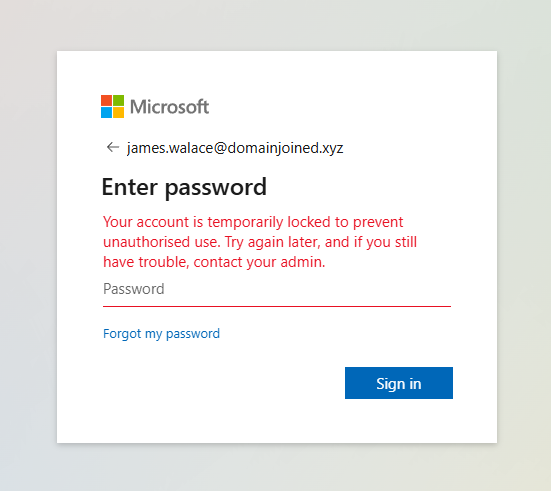
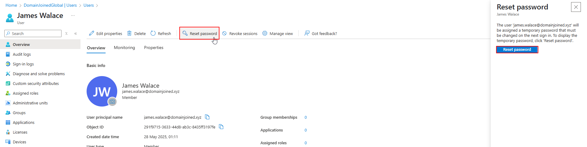
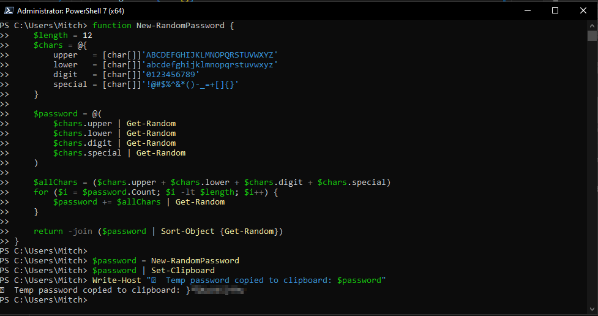
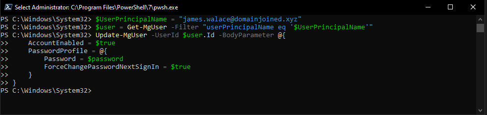

# 🎫 Ticket SD-1024 – Password Reset for Locked-Out User

## 📘 Table of Contents
- [📄 Request Summary](#request-summary)  
- [📝 Requested Actions](#requested-actions)  
- [🖱️ GUI (Azure Portal)](#full-process---azure-portal-gui)
- [💻 PowerShell (Step-by-Step)](#full-process---powershell-step-by-step)  
- [⚙️ Script Automation](#script-automation)  
- [✅ Resolution](#resolution)

---

## Request Summary

The user **James Wallace** is unable to sign in to his Microsoft 365 account. After multiple failed login attempts, his account was temporarily locked. IT Support received a request to unlock the account and reset his password.

---

## Requested Actions

- Reset the password for `james.wallace@domainjoined.xyz`  
> 👤 The user reported seeing the following error message when attempting to log in:


- Force a password change at next sign-in  
- Optionally unblock sign-in if the account is locked

---

## Full Process - Azure Portal (GUI)

> 📄 The following sign-in logs confirm repeated failed attempts for James Wallace, triggering smart lockout:


### 1. Locate the User
- Navigate to **Microsoft Entra ID > Users**
- Search for **James Wallace** or his UPN
- Click on the user profile


### 2. Reset Password
- In the user’s overview pane, click **Reset Password**
- Click **Auto-generate password** (or specify manually)
- Ensure **Require this user to change their password when they first sign in** is enabled
- Copy the password and provide it securely to the user




---

## Full Process - PowerShell (Step-by-Step)

### 1. Generate a New Password
```powershell
function New-RandomPassword {
    $length = 12
    $chars = @{
        upper   = [char[]]'ABCDEFGHIJKLMNOPQRSTUVWXYZ'
        lower   = [char[]]'abcdefghijklmnopqrstuvwxyz'
        digit   = [char[]]'0123456789'
        special = [char[]]'!@#$%^&*()-_=+[]{}'
    }

    $password = @(
        $chars.upper | Get-Random
        $chars.lower | Get-Random
        $chars.digit | Get-Random
        $chars.special | Get-Random
    )

    $allChars = ($chars.upper + $chars.lower + $chars.digit + $chars.special)
    for ($i = $password.Count; $i -lt $length; $i++) {
        $password += $allChars | Get-Random
    }

    return -join ($password | Sort-Object {Get-Random})
}

$password = New-RandomPassword
$password | Set-Clipboard
Write-Host "🔐 Temp password copied to clipboard: $password"
```


### 2. Reset User’s Password in Entra ID
```powershell
$user = Get-MgUser -Filter "userPrincipalName eq 'james.wallace@domainjoined.xyz'"

Update-MgUser -UserId $user.Id -PasswordProfile @{
    Password = $password
    ForceChangePasswordNextSignIn = $true
}

Write-Host "✅ Password reset complete for $UserPrincipalName and account enabled." -ForegroundColor Green
```

> 💡 If the account is also locked, you can optionally unblock it via the GUI or let Azure automatically unblock it after a cooldown period.



---

## Script Automation

Use a modular script for quick resets:
```powershell
.\scripts\reset-user-password.ps1
```

The script will:
- Accept UPN as input
- Generate and apply a new secure password
- Copy password to clipboard for secure delivery

Example:
```powershell
.\scripts\reset-user-password.ps1 -UserPrincipalName "james.wallace@domainjoined.xyz"
```

---

## Resolution
- Review of sign-in logs confirmed smart lockout occurred due to repeated failed sign-ins.

The account for **James Wallace** was successfully unlocked by resetting the password and requiring a change at next sign-in. The temporary password was securely provided to the user via internal channels.

🗂️ Ticket Closed.
