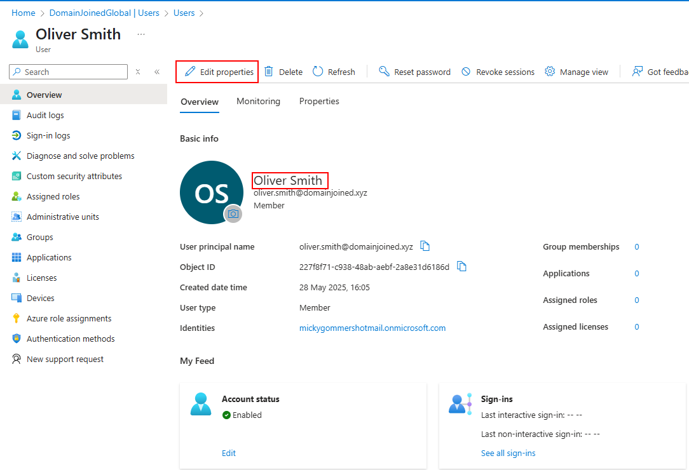
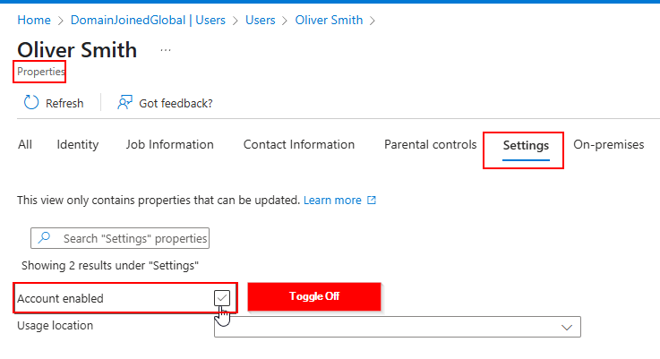
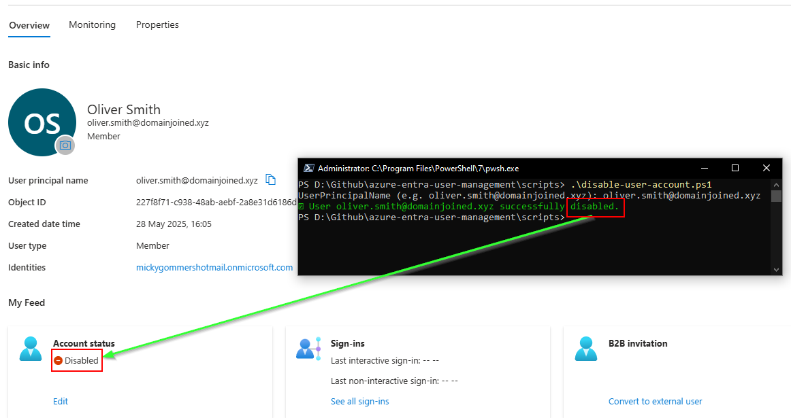

# 🎫 Ticket SD-1025 – User Offboarding: Disable Account

## 📘 Table of Contents

- [📄 Request Summary](#request-summary)
- [📝 Requested Actions](#requested-actions)
- [🖱️ GUI (Azure Portal)](#full-process---azure-portal-gui)
- [⚙️ Script Automation](#script-automation)
- [✅ Resolution](#resolution)

---

## Request Summary

IT was notified that **Oliver Smith** has left the organization and must be offboarded immediately.

---

## Requested Actions

- Disable the user account in Microsoft Entra ID
- Prevent any further logins or access

---

## Full Process - Azure Portal (GUI)

### 1. Locate User Account
- Navigate to **Microsoft Entra ID > Users**
- Search for `oliver.smith@domainjoined.xyz` and open the user profile

### 2. Disable Account
- Click **Edit Properties**
- Navigate to **Settings**
- Uncheck **Account Enabled** (green checkmark toggle)
- Click **Save**

  


---

## Script Automation

Use the following PowerShell script to disable a user account safely and confirm the action succeeded:

```powershell
.\scripts\disable-user-account.ps1
```

```powershell
param (
    [string]$UserPrincipalName
)

# Prompt if not provided
if (-not $UserPrincipalName) {
    $UserPrincipalName = Read-Host "UserPrincipalName (e.g. oliver.smith@domainjoined.xyz)"
}

# Get the user
$user = Get-MgUser -Filter "userPrincipalName eq '$UserPrincipalName'"

if (-not $user) {
    Write-Host "❌ User not found: $UserPrincipalName" -ForegroundColor Red
    exit 1
}

# Disable the user
try {
    Update-MgUser -UserId $user.Id -AccountEnabled:$false

    # Re-fetch with specific property to verify
    $updatedUser = Get-MgUser -UserId $user.Id -Property "accountEnabled"

    if ($updatedUser.AccountEnabled -eq $false) {
        Write-Host "✅ User $UserPrincipalName successfully disabled." -ForegroundColor Green
    } else {
        Write-Host "⚠️ Attempted to disable $UserPrincipalName, but status did not change." -ForegroundColor Yellow
    }
}
catch {
    Write-Host "❌ Failed to disable user: $_" -ForegroundColor Red
}
```

> 🖼️ Screenshot below shows successful execution of the account disable script:



---

## Resolution

The account for **Oliver Smith** was successfully disabled using both GUI and PowerShell automation. Sign-ins are now blocked, and the user no longer has access to organizational resources.

🗂️ Ticket Closed.
