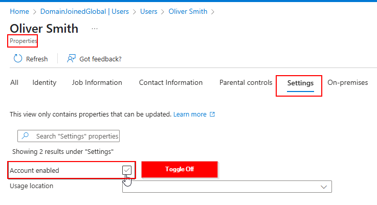
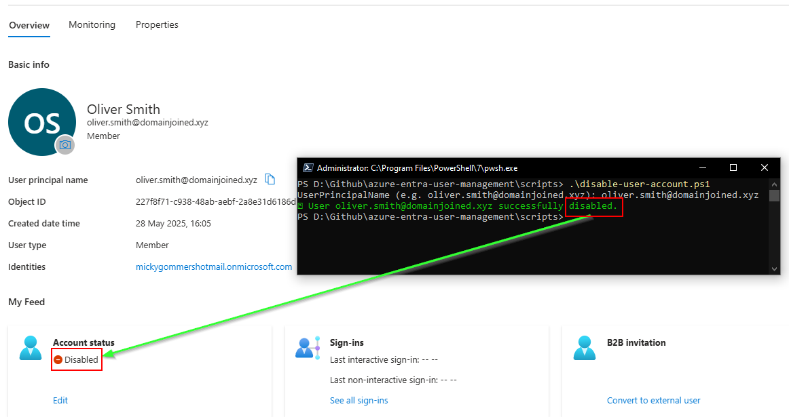

# 🎫 Ticket ID: SD-1025 - User Offboarding: Disable Account

## 🏢 Scenario

The HR department at **DomainJoinedGlobal** has informed IT support that **Oliver Smith**, a Finance team member, has left the organization effective immediately. IT has received a formal offboarding request to disable the user's Microsoft Entra ID account to prevent any further access to internal systems.

This request came in via the helpdesk portal and must be completed by the end of the business day for compliance and security purposes.

<details>
  <summary>📋 View Employee Details</summary>

  - **Full Name:** Oliver Smith  
  - **Job Title:** Financial Analyst  
  - **Department:** Finance  
  - **Username:** oliver.smith  
  - **Email:** oliver.smith@domainjoined.xyz

</details>

---

## 🎯 Objective
- Disable Oliver Smith's Microsoft Entra ID account immediately
- Ensure he can no longer sign in to Microsoft 365 or corporate resources
- Document both GUI and PowerShell methods for auditing

---

## 🛠️ Technologies Used
- **Microsoft Entra ID (Azure Active Directory)**
- **Azure Portal (GUI)**
- **PowerShell**
- **Microsoft Graph PowerShell SDK**

---

## 🖥️ Method 1: GUI

<details>
  <summary>📸 Step 1: Locate and Edit the User Account</summary>

  - Go to **Microsoft Entra ID > Users**
  - Search for **Oliver Smith** or use his email: `oliver.smith@domainjoined.xyz`
  - Click on the user to open their profile page
  - Click **Edit Properties**

    

</details>

<details>
  <summary>📸 Step 2: Disable the Account</summary>

  - In the **Settings** section, uncheck **Account enabled**
  - Click **Save**

  

</details>

---

## 💻 Method 2: PowerShell / Script Automation

### Script Command:
```powershell
.\scripts\disable-user-account.ps1
```

### Script Execution:
<details>
  <summary>📸 PowerShell Output</summary>

  

</details>

---

## 🗂️ Summary

Oliver Smith's account was successfully disabled in Microsoft Entra ID using both GUI and PowerShell methods. This action prevents sign-in to Microsoft 365 and all corporate resources, effectively offboarding him from the environment.

This task was handled as a part of routine offboarding operations in line with DomainJoinedGlobal's identity lifecycle policy.

---

## 📂 Project Files
- [`disable-user-account.ps1`](../../scripts/disable-user-account.ps1)
