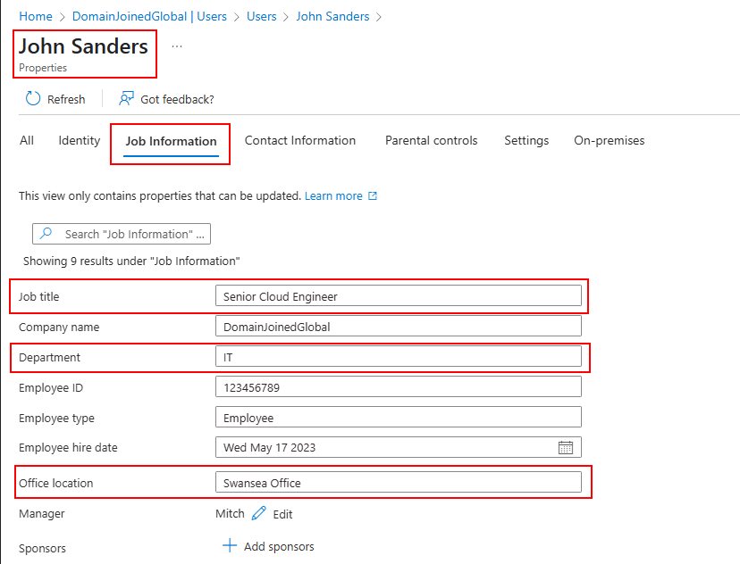
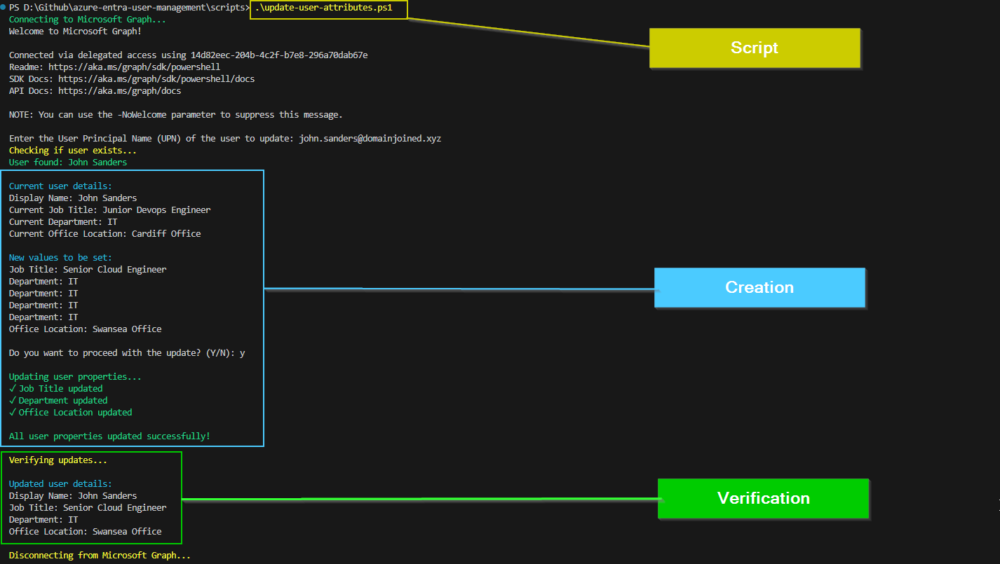

# 🎫 Ticket ID: SD-1026 - Update User Properties (Single Edit)

## 🏢 Scenario

It’s mid-day at **DomainJoinedGlobal**, and the IT department has submitted a ticket to the internal helpdesk.  
**John Sanders**, a cloud engineer, has recently been promoted. His title and department must be updated in Microsoft Entra ID to reflect the new role.

As the assigned support engineer, your responsibility is to ensure that John’s title is updated to **Senior Cloud Engineer**, and his department remains correctly listed as **IT**. This update must be completed and verified through both GUI and PowerShell, following standard compliance and documentation practices.

<details>
  <summary>📋 View Employee Details</summary>

  - **Full Name:** John Sanders  
  - **Old Title:** Cloud Engineer  
  - **New Title:** Senior Cloud Engineer  
  - **Department:** IT  
  - **Email:** john.sanders@domainjoined.xyz  
  - **Username:** john.sanders  

</details>

---

## 🎯 Objective

- Update the job title and department of John Sanders  
- Confirm changes were applied successfully  
- Document both GUI and PowerShell methods for audit purposes

---

## 🛠️ Technologies Used

- **Microsoft Entra ID (Azure Active Directory)**  
- **Azure Portal (GUI)**  
- **PowerShell**  
- **Microsoft Graph PowerShell SDK**  

---

## 🖥️ Method 1: GUI
### Guided Steps:

<details>
  <summary>📸 Step 1: Locate and Edit User Properties</summary>

  - Navigate to **Microsoft Entra ID > Users**
  - Search for **John Sanders**
  - Click on the user to open the profile
  - Click **Edit Properties**
  - Scroll to the **Job info** section
  - Update **Job Title** to `Senior Cloud Engineer`
  - Confirm **Department** is `IT`
  - Click **Save**

  
</details>

---

## 💻 Method 2: PowerShell / Script Automation

### Script Command:
```powershell
.\scripts\update-user-properties.ps1
```
> **Note:** This example demonstrates a **single-user update using UPN input** instead of a CSV to simulate a quick change request and highlight multiple approaches to achieving the same result.

### Script Execution:

<details>
  <summary>📸 PowerShell Output</summary>

  
</details>

---

## 🗂️ Summary

John Sanders’ account details have been successfully updated in Microsoft Entra ID. His **Job Title** now reflects `Senior Cloud Engineer`, and the **Department** is confirmed to be `IT`. This ensures internal records and access policies are properly aligned with his new responsibilities.

This change was documented using both the GUI and PowerShell approaches.

---

## 📂 Project Files

- [`Update-User-Properties.ps1`](../../scripts/update-user-properties.ps1)