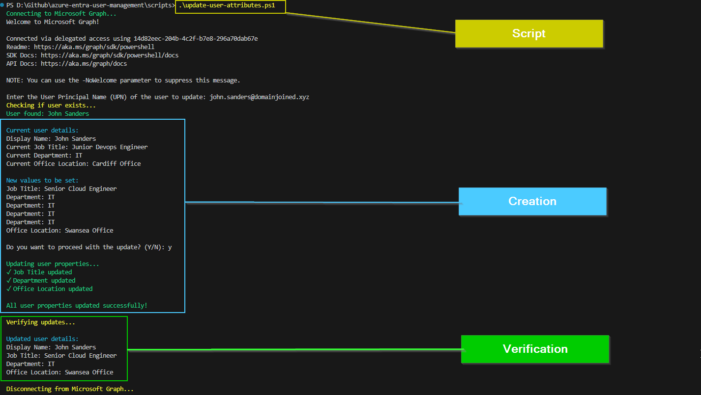

# 🧾 SD-1026 - Update User Profile Attributes Based on Departmental Standards

## 📚 Table of Contents
- [🎯 Goal](#goal)
- [🧪 Scenario](#scenario)
- [🧰 Tools Used](#tools-used)
- [🖱️ GUI Walkthrough](#gui-walkthrough)
- [⚙️ Automation (PowerShell)](#automation-powershell)
- [✅ Validation](#validation)

---

## Goal

Standardize user profiles in Microsoft Entra ID by updating key attributes such as:
- Job Title
- Department
- Office Location
- Manager (optional)

These attributes are important for organizational clarity, automation, and downstream apps like Teams and Outlook.

---

## Scenario

HR notifies IT that employee **John Sanders** has been promoted to **Senior Cloud Engineer** in **IT**, located in the **Swansea Office**. Your task is to update the user profile accordingly.

> This ticket focuses **on profile updates** (job title, department, location).  

## Tools Used

| Tool/Service         | Purpose                                     |
|----------------------|---------------------------------------------|
| Microsoft Entra ID   | GUI user profile editing                    |
| Microsoft Graph SDK  | Automating updates via `Update-MgUser`     |
| PowerShell           | Running automation script locally           |
| VS Code              | Writing and organizing project scripts/docs |


## GUI Walkthrough

1. Go to **Microsoft Entra ID** > **Users**.
2. Search for `John Sanders` and open their profile.
3. Click **Edit properties**.
4. Update the following fields:
   - **Job title**: `Senior Cloud Engineer`
   - **Department**: `IT`
   - **Office location**: `Swansea Office`
5. Click **Save**.
6. Automatically return to the user's profile where you can verify the changes

📷 *Edit Properties GUI*


## Automation (Powershell)

To perform the same operation using PowerShell and Microsoft Graph:

```powershell
.\scripts\update-user-attributes.ps1
```
This script works as follows:
- Connects to Microsoft Graph
- Prompts for User Principal Name
- Validates UPN
- Confirms modifications to be executed
- Verifies/validates the update


📷 *Script Execution Powershell*

---


