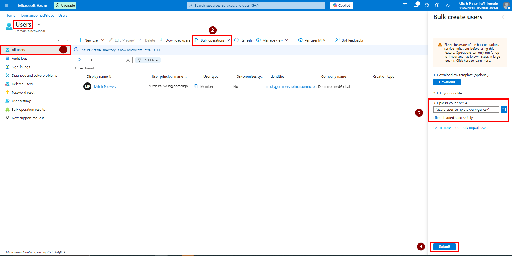
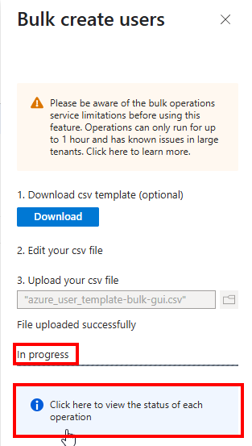
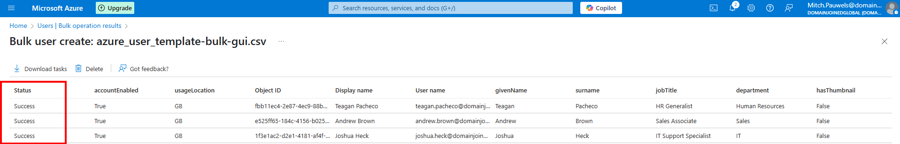
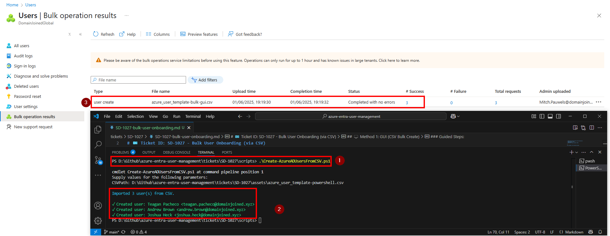

# 🎫 Ticket ID: SD-1027 - Bulk User Onboarding (via CSV)

## 🏢 Scenario

HR has submitted a request to onboard three new employees across different departments at **DomainJoinedGlobal**. Rather than manually creating accounts one by one, they’ve provided a CSV file with all the required user details. This is a common practice for onboarding waves and must be completed efficiently using bulk tools available in the Microsoft 365 ecosystem.

As the assigned IT support engineer, your goal is to create these accounts using both the GUI and PowerShell automation to demonstrate flexibility and operational readiness.

<details>
  <summary>📋 View Employee Batch</summary>

  **New Hires:**

  1. **Teagan Pacheco** – HR Generalist – Human Resources
  2. **Andrew Brown** – Sales Associate – Sales
  3. **Joshua Heck** – IT Support Specialist – IT

  Each user will be created with a predefined secure password and required to reset it upon first login.

</details>

---

## 🎯 Objective

- Create Microsoft Entra ID accounts for all 3 users
- Use both GUI and PowerShell to demonstrate versatility
- Upload and validate using standard CSV structure
- Ensure accounts are active and configured for password reset at next sign-in

---

## 🛠️ Technologies Used

- **Microsoft Entra ID (Azure Active Directory)**
- **Azure Portal (GUI)**
- **PowerShell**
- **Microsoft Graph PowerShell SDK**

---

## 🖥️ Method 1: GUI (CSV Bulk Create)

### Guided Steps:

<details>
  <summary>📸 Step 1: Upload the Bulk CSV File</summary>

  - Go to **Microsoft Entra ID > Users > All users**
  - Click **+ Bulk create** at the top
  - Upload your CSV file: [`azure_user_template-bulk-gui.csv`](../../assets/azure_user_template-bulk-gui.csv)
  - Click **Submit** to process the accounts

  

</details>

<details>
  <summary>📸 Step 2: Confirm Success</summary>

  - A job status window will appear
  - Monitor progress in **Bulk Operations**
  - Observe the **User Creation Status** 

  
  

</details>

---

## 💻 Method 2: PowerShell / Script Automation

### Script Command:
```powershell
.\scripts\Create-AzureADUsersFromCSV.ps1
```

### Script Execution:

<details>
  <summary>📸 PowerShell Output</summary>

  

</details>

---

## 📋 Summary

All three users — Teagan Pacheco, Andrew Brown, and Joshua Heck — were successfully onboarded into **DomainJoinedGlobal** using both the Azure Portal and PowerShell automation.

This demonstrates flexibility in handling onboarding requests and adherence to best practices in identity lifecycle management.

Licensing and group assignment will be handled in separate tickets to maintain modularity and simulate real-world staged provisioning.

---

## 📂 Project Files

- [`Create-AzureADUsersFromCSV.ps1`](../../scripts/Create-AzureADUsersFromCSV.ps1)
- [`azure_user_template-bulk-gui.csv`](../../assets/azure_user_template-bulk-gui.csv)
- [`azure_user_template-bulk.csv`](../../assets/azure_user_template-powershell.csv)
