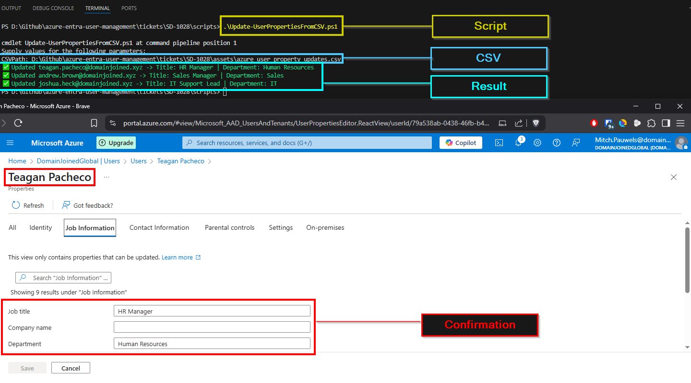

# 🎫 Ticket ID: SD-1028 - Bulk Update User Properties (via CSV)

## 🏢 Scenario

The IT department at **DomainJoinedGlobal** has received a request to update the job titles and departments for several employees across different departments. Rather than performing updates manually, HR has provided a properly formatted CSV file containing the changes.

You’ve been assigned as the support engineer responsible for processing these updates using PowerShell automation. This method ensures speed, consistency, and compliance with internal data accuracy policies.

<details>
  <summary>📋 Users to Update</summary>

  - **Teagan Pacheco** – New Title: *HR Manager* – Department: *Human Resources*  
  - **Andrew Brown** – New Title: *Sales Manager* – Department: *Sales*  
  - **Joshua Heck** – New Title: *IT Support Lead* – Department: *IT*

</details>

---

## 🎯 Objective

- Perform a bulk update of user attributes using PowerShell and a CSV file  
- Ensure all updates apply correctly and are logged  
- Use proper data validation for job title and department updates

---

## 🛠️ Technologies Used

- **Microsoft Entra ID (Azure Active Directory)**  
- **PowerShell**  
- **Microsoft Graph PowerShell SDK**

---

## 💻 Method: PowerShell Script Automation (CSV Input)

### Script Command
```powershell
.\scripts\Update-UserPropertiesFromCSV.ps1
```

> The script reads the provided CSV and updates each user’s job title and department. It validates the input format and checks whether the user exists before attempting updates.

### Example CSV Input
```csv
UserPrincipalName,JobTitle,Department
teagan.pacheco@domainjoined.xyz,HR Manager,Human Resources
andrew.brown@domainjoined.xyz,Sales Manager,Sales
joshua.heck@domainjoined.xyz,IT Support Lead,IT
```

### Script Execution

<details>
  <summary>📸 PowerShell Output</summary>

  

</details>

> ***Note*** : In the screenshot I have included the result of 1 of the employee's to showcase that the script has executed properly.

---


## 🗂️ Summary

The user attributes for **Teagan Pacheco**, **Andrew Brown**, and **Joshua Heck** were successfully updated using PowerShell automation. This task demonstrates how to handle multi-user property changes in bulk while maintaining accuracy and compliance with internal directory policies.

This bulk update method is particularly useful when dealing with departmental reorgs, mass promotions, or cleanup tasks requested by HR.

---

## 📂 Project Files

- [`Update-UserPropertiesFromCSV.ps1`](../../scripts/Update-UserPropertiesFromCSV.ps1)  
- [`azure_user_property_updates.csv`](../../assets/azure_user_property_updates.csv)
