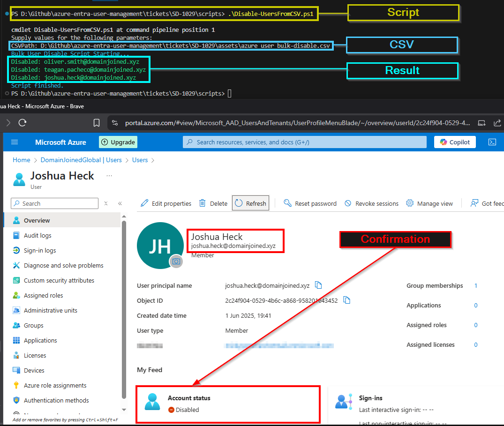

# 🎫 Ticket ID: SD-1029 - Bulk Offboarding (Disable Multiple Users)

## 🏢 Scenario

It’s the end of the quarter at **DomainJoinedGlobal**, and the HR department has submitted an offboarding list of several employees who have departed or transitioned out of their roles.  

To comply with internal security policies, the IT team must immediately disable their Microsoft Entra ID accounts in bulk. This prevents further sign-ins to Microsoft 365 and access to internal systems.

You are assigned as the support engineer responsible for executing this request efficiently using a PowerShell script and a CSV file provided by HR.

<details>
  <summary>📋 View Employee List</summary>

  - **Oliver Smith** – Financial Analyst – Finance  
  - **Teagan Pacheco** – HR Manager – Human Resources  
  - **Joshua Heck** – IT Support Lead – IT  

</details>

---

## 🎯 Objective

- Disable multiple Entra ID accounts in bulk based on the HR-provided CSV  
- Ensure each account is disabled reliably and logged  
- Validate input structure and handle errors gracefully  

---

## 🛠️ Technologies Used

- **Microsoft Entra ID (Azure Active Directory)**  
- **PowerShell**  
- **Microsoft Graph PowerShell SDK**  

---

## 💻 Method: PowerShell Script Automation (CSV Input)

### Script Command
```powershell
.\scripts\Disable-UsersFromCSV.ps1
```

> This script reads a list of users from a CSV file and disables each one. It validates inputs, confirms user existence, and handles individual failures gracefully for auditing.

### Example CSV Input
```csv
UserPrincipalName
oliver.smith@domainjoined.xyz
teagan.pacheco@domainjoined.xyz
joshua.heck@domainjoined.xyz
```

### Script Execution

<details>
  <summary>📸 PowerShell Output</summary>

  

</details>

> ***Note*** : In the screenshot I have included the result of 1 of the employee's to showcase that the script has executed properly.

---

## 🗂️ Summary

The accounts for **Oliver Smith**, **Teagan Pacheco**, and **Joshua Heck** were successfully disabled using a bulk PowerShell script.

This task reflects a real-world offboarding scenario where automation is crucial for reliability, speed, and audit readiness.

---

## 📂 Project Files

- [`Disable-UsersFromCSV.ps1`](../../scripts/Disable-UsersFromCSV.ps1)  
- [`azure_user_bulk-disable.csv`](../../assets/azure_user_bulk-disable.csv)
