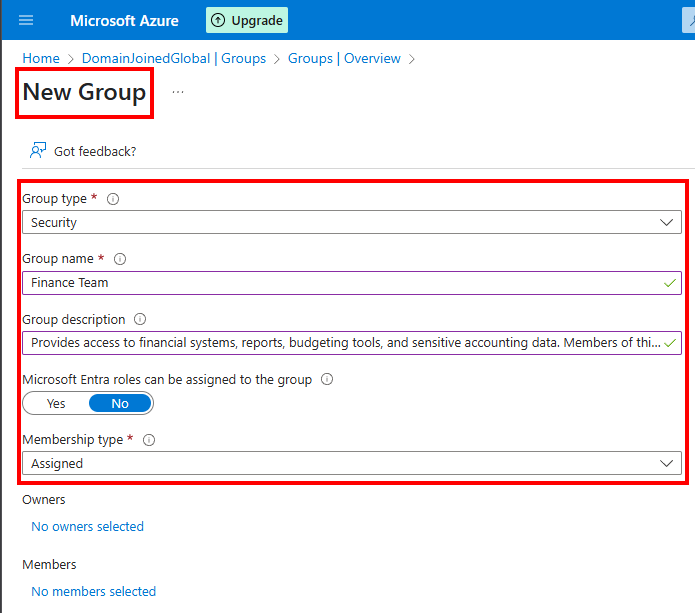
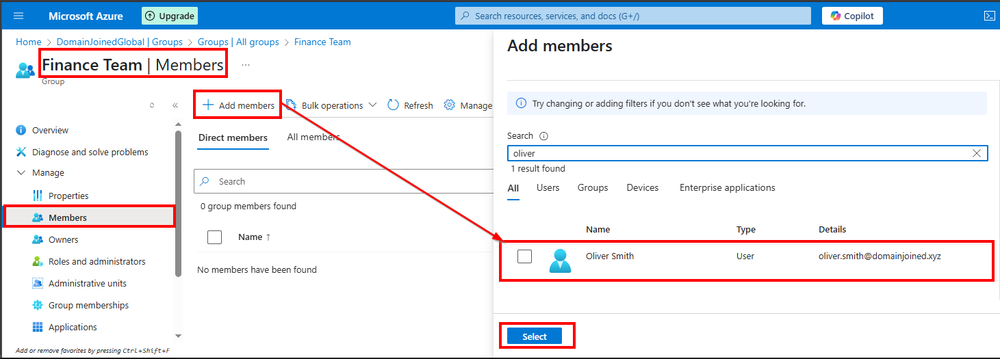
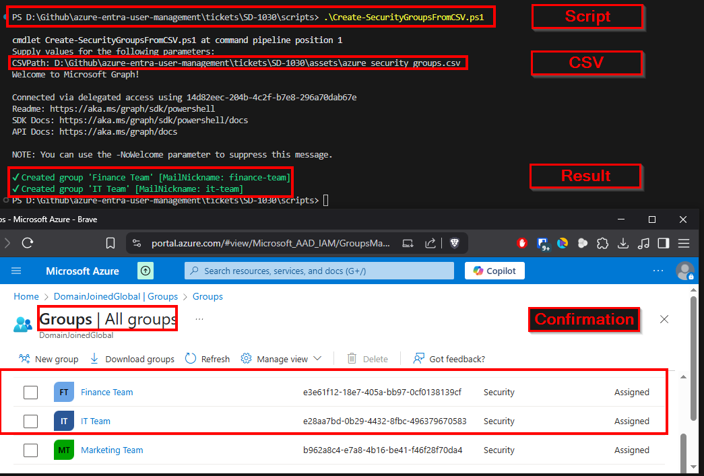
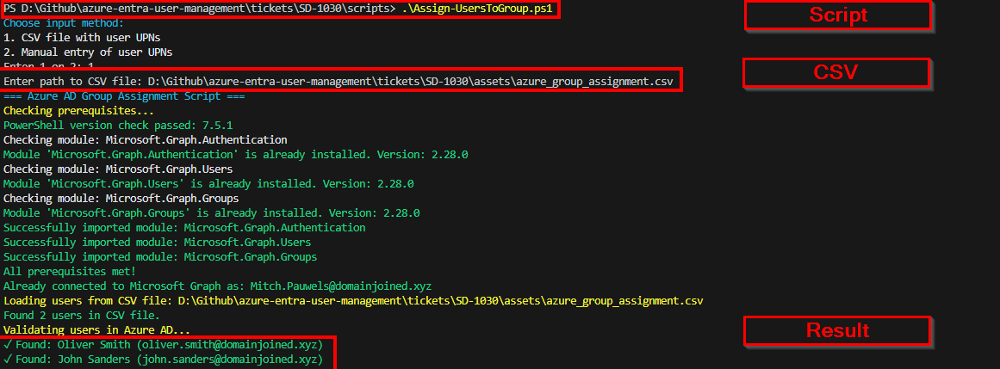
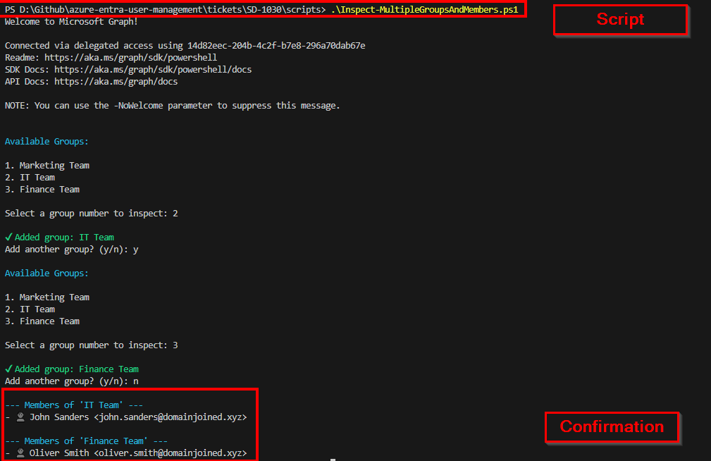

# 🎫 Ticket ID: SD-1030 - Create Security Groups + Assign Members

## 🏢 Scenario

The IT team at **DomainJoinedGlobal** is implementing a new access control policy that organizes users by department. Each department will have a dedicated **Microsoft Entra security group** to simplify permission assignment, resource access, and license management.

You’ve received a ticket to create the following security groups and assign members based on the provided HR list.

<details>
  <summary>📋 Groups and Membership</summary>

  - **Group:** Finance Team  
    **Members:** Oliver Smith

  - **Group:** IT Team  
    **Members:** John Sanders

</details>

---

## 🎯 Objective

- Create Microsoft Entra security groups for Finance and IT
- Assign each user to their respective group
- Demonstrate both GUI and PowerShell methods
- Validate that each group contains the correct members

---

### Sample CSV Input
```csv
DisplayName,Description,MailNickname,GroupType,MembershipType,AssignEntraRole
Finance Team,Finance staff group,,Security,Assigned,false
IT Team,All IT engineers,,Security,Assigned,true
```

> This enhanced script allows you to fully configure Microsoft Entra security groups using a CSV file.  
> It supports `DisplayName`, `Description`, `MailNickname`, `GroupType` (Security/Microsoft365), `MembershipType` (Assigned), and whether the group is assignable to Entra roles.  
> If `MailNickname` is not specified, it is automatically generated from the display name.  
> Dynamic group support is planned for a future ticket.


## 🖥️ Method 1: GUI

### Step-by-Step (with Screenshots)

<details>
  <summary>📸 Step 1: Create Security Groups</summary>

  - Go to **Microsoft Entra ID > Groups > + New Group**
  - Select **Security** as the group type
  - Name the group (e.g., `Finance Team` or `IT Team`)
  - Description: Optionally describe the group's purpose
  - Membership type: **Assigned**
  - Click **Create**

  
</details>

<details>
  <summary>📸 Step 2: Add Members to Groups</summary>

  - Open the group you just created
  - Go to **Members > + Add Members**
  - Search and select the appropriate user(s)
  - Click **Select > Add**

  
</details>

---


## 💻 Method 2: PowerShell / Script Automation

<details>
  <summary>📸 Step 1: Create Security Groups</summary>

### Script Command
```powershell
.\scripts\Create-SecurityGroupsFromCSV.ps1
```

> This script will create security groups defined in the CSV, including:
> - Group name (`DisplayName`)
> - Description
> - MailNickname (auto-generated if missing)
> - Membership type (`Assigned`)
> - Role assignability

<details>
  <summary>📸 PowerShell Output</summary>

  
</details>

</details>

<details>
  <summary>📸 Step 2: Add Members to Groups</summary>

  ### Script Command
  ```powershell
  .\scripts\Assign-UsersToGroupsFromCSV.ps1
  ```

  > This script reads a CSV file where each row maps a user to a target group.  
  > It ensures that users are added only to their designated groups, and validates that both user and group exist.

  ### Sample CSV Input
  ```csv
  UserPrincipalName,GroupDisplayName
  oliver.smith@domainjoined.xyz,Finance Team
  john.sanders@domainjoined.xyz,IT Team
```

### Script Execution
<details>
  <summary>📸 PowerShell Output</summary>

  
</details>

</details>

<details>
  <summary>📸 Step 3: Confirm Members in Groups</summary>

  ### Script Command
  ```powershell
  .\scripts\Inspect-MultipleGroupsAndMembers.ps1
  ```

  > This script will ask you to pick the security groups and will then show you which users are currently assigned to the selected groups

### Script Execution
<details>
  <summary>📸 PowerShell Output</summary>

  
</details>

</details>

## 🗂️ Summary

Both the **Finance Team** and **IT Team** security groups were created successfully, and the correct members were added using both the Azure Portal and PowerShell automation.

This demonstrates a key identity governance task for access management and supports group-based resource permissions and license assignments.

---

## 📂 Project Files

- [`Create-SecurityGroupsFromCSV.ps1`](./scripts/Create-SecurityGroupsFromCSV.ps1)  
- [`azure_security_groups.csv`](./assets/azure_security_groups.csv)  
- [`Assign-UsersToGroup.ps1`](./scripts/Assign-UsersToGroup.ps1)  
- [`azure_group_assignment.csv`](./assets/azure_group_assignment.csv)
- [`Inspect-MultipleGroupsAndMembers.ps1`](./scripts/Inspect-MultipleGroupsAndMembers.ps1)  

