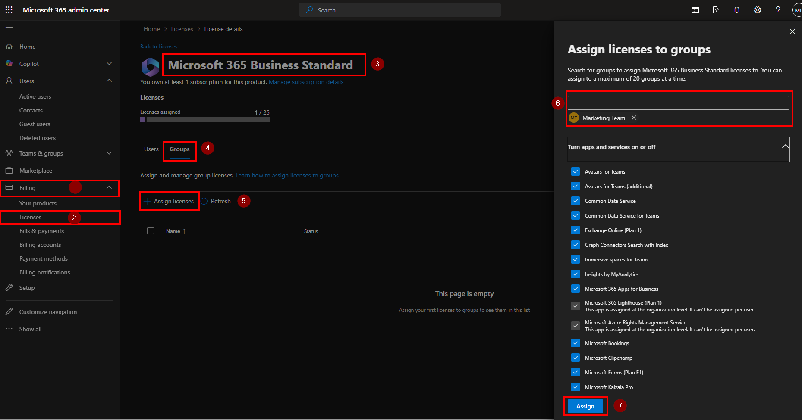
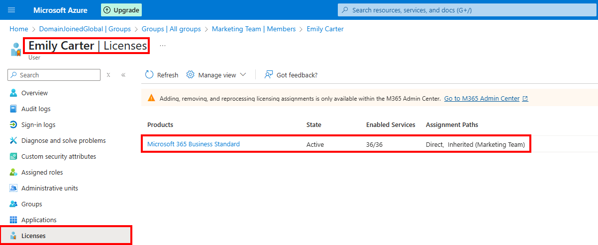

# 🎫 Ticket ID: SD-1031 - Assign Microsoft 365 Licenses via Group-Based Licensing

## 🏢 Scenario

As part of a new licensing strategy, **DomainJoinedGlobal** is shifting from direct user licensing to **group-based license assignment**. This simplifies management and ensures users receive appropriate services based on their role or department.

The IT support team has been tasked with configuring this in Microsoft Entra ID. You will assign the **Microsoft 365 Business Standard** license to the **Marketing Team** group. All members of the group will inherit the license automatically.

<details>
  <summary>📋 Licensing Assignment Details</summary>

  - **Target Group:** Marketing Team  
  - **License to Assign:** Microsoft 365 Business Standard  
  - **Existing Member(s):** Emily Carter
</details>

---

## 🎯 Objective

- Assign a Microsoft 365 license to a security group  
- Ensure all members of the group receive the license  
- Demonstrate both GUI and PowerShell methods  
- Verify license assignment status

---

## 🛠️ Technologies Used

- **Microsoft Entra ID (Azure AD)**  
- **Microsoft 365 Admin Center**  
- **PowerShell**  
- **Microsoft Graph PowerShell SDK**

---

## 🖥️ Method 1: GUI – Assign License to Group (via Microsoft 365 Admin Center)

<details>
  <summary>📸 Step-by-Step</summary>

  1. Go to **https://admin.microsoft.com**  
  2. Navigate to **Billing > Licenses**  
  3. Select the license product (e.g., **Microsoft 365 Business Standard**)  
  4. Click the **Groups** tab  
  5. Click **Assign licenses**  
  6. Search for and select the **Marketing Team** group  
  7. Click **Assign**  
<details>
  <summary>📸 Preview Assigned License</summary>
    
  
  
</details>

---
  🧪 After assignment:
  - Go to **Users > Active Users**
  - Find **Emily Carter** and confirm she has inherited the **Microsoft 365 Business Standard** license in the **Licenses** column.
  - Confirm the license is **inherited from the Marketing Team group**
  

  <details>
  <summary>📸 Confirmation Inherited License</summary>
    
  
  </details>
</details>

---

## 💻 Method 2: PowerShell – Group License Assignment via Script

> This PowerShell script will:
> - Prompt you to select a group via a gui
> - Let you choose a license from available SKUs via gui
> - Assign the license to the group

### 📜 Script
```powershell
.\scripts\Assign-LicenseToGroup.ps1
```

### 📸 Execution Screenshot
<details>
  <summary>Script Execution</summary>

  

</details>

---

## 🧪 Verification: Confirm Member Licensing Inheritance

After assigning the license to the group:

1. Go to **https://portal.azure.com/ > Users > Emily Carter**  
2. Click **Licenses**  
3. Under “Assignment path”, confirm it says:  
   > *"Inherited from: Marketing Team"*

This ensures group-based licensing is working correctly.

<details>
  <summary>📸 Inherited License Confirmation</summary>

  

</details>

---

## 🗂️ Summary

The **Marketing Team** group was successfully assigned the **Microsoft 365 Business Standard** license.  
Emily Carter automatically received the license through inheritance, ensuring scalable and consistent license management.  

This method reduces administrative effort and simplifies license compliance.

---

## 📂 Project Files

- [`Assign-LicenseToGroup.ps1`](../../scripts/Assign-LicenseToGroup.ps1)
