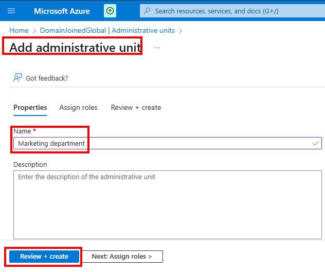
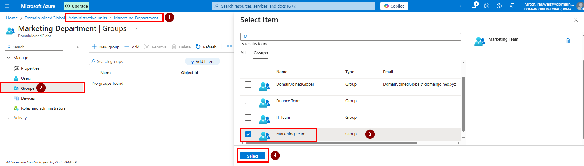
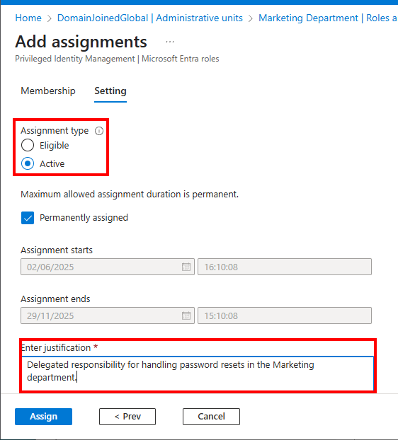
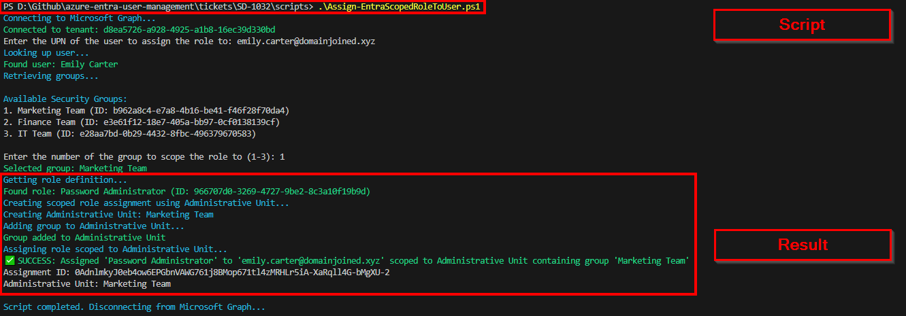

# 🎫 Ticket ID: SD-1032 - Assign Role Scoped to Group via Administrative Unit

## 🏢 Scenario

To support scoped administrative access, **DomainJoinedGlobal** needs to delegate password reset rights to team-specific admins.

**Emily Carter**, the **Marketing Coordinator**, should be able to reset passwords **only** for users in the `Marketing Team`. Microsoft Entra ID supports this via **Administrative Units (AUs)** combined with role scoping.

---

## 🎯 Objective

- Assign Emily Carter the **Password Administrator** role
- Scope the role to a new **Administrative Unit** that contains the `Marketing Team` group

---

## 🛠️ Technologies Used

- **Microsoft Entra Admin Center (GUI)**
- **PowerShell with Microsoft Graph SDK**
- **Administrative Units (AUs)**

---

## 🖥️ Method 1: GUI – Assign Scoped Role

<details>
  <summary>📸 1. Create Marketing Department AU</summary>

  1. Go to **https://entra.microsoft.com**
  2. Navigate to **Microsoft Entra ID > Administrative Units**
  3. Click **+ Add** and name it: `Marketing Department`
  4. Add a description and click **Create**
  
</details>

<details>
  <summary>📸 2. Add Group to the AU</summary>

  1. Open the AU → go to **Groups**
  2. Click **+ Add** and select `Marketing Team`
  3. Confirm group is now listed as part of the AU
  
</details>

<details>
  <summary>📸 3. Assign Role Scoped to the AU</summary>

  1. Go to **Roles and administrators**
  2. Select **Password Administrator**
  3. Click **+ Add assignments**
  4. Choose **Emily Carter**
  5. In the **Scope**, choose **Administrative Unit**
     - Select `Marketing Department`
  6. Assignment Type: **Active**
  7. Justification: `Delegated access to reset passwords for marketing staff only`
  8. Click **Assign**
  
</details>

---

## 💻 Method 2: PowerShell – Scoped Role via AU

> This method uses Microsoft Graph SDK and works by:
> - Creating the AU if needed
> - Adding the group to the AU
> - Assigning the scoped role using the proper v2 Graph syntax

### 📜 Script
```powershell
.\scripts\Assign-EntraScopedRoleToUser.ps1
```

### 📸 Execution Screenshot

<details>
  <summary>Script Output</summary>

  
</details>

---

## 🧪 Verification

To verify the assignment:
- Go to **Users > Emily Carter > Assigned roles**
- Confirm:
  - **Password Administrator**
  - **Scope**: Marketing Department (AU)
  - **Type**: Active

---

## 🗂️ Summary

Emily Carter has been assigned the **Password Administrator** role, scoped via an **Administrative Unit** that contains the `Marketing Team` group. This follows Entra best practices for limited delegation using role-based access control and minimizes risk.

---

## 📂 Project Files

- [`Assign-EntraScopedRoleToUser.ps1`](../../scripts/Assign-EntraScopedRoleToUser.ps1)
