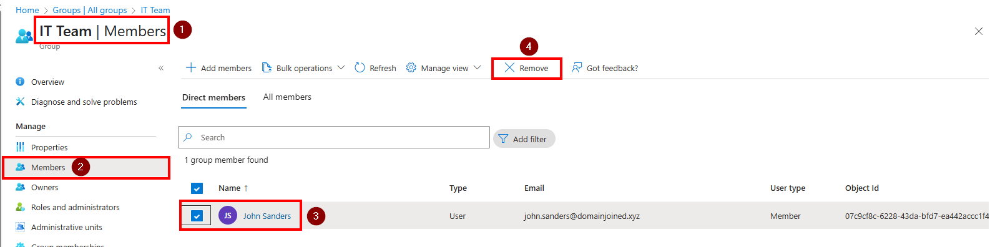
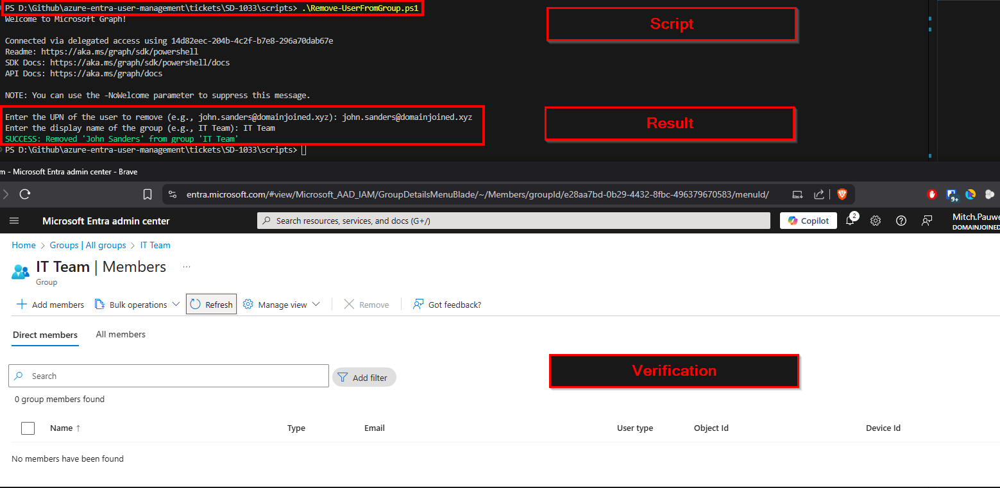

# 🎫 Ticket ID: SD-1033 - Remove User from Group

## 🏢 Scenario

**DomainJoinedGlobal** is streamlining access control. The **IT Department** has requested that a specific user — **John Sanders** — be removed from the `IT Team` security group due to a departmental reorganization.

As the assigned support engineer, you must process this removal request using both the GUI and PowerShell. Documentation should include confirmation of successful removal.

<details>
  <summary>📋 View User Details</summary>

  - **Full Name:** John Sanders  
  - **Job Title:** Senior Cloud Engineer  
  - **Department:** IT  
  - **Email:** john.sanders@domainjoined.xyz  
  - **Group to Remove:** IT Team

</details>

---

## 🎯 Objective

- Remove a user from a Microsoft Entra security group  
- Confirm removal via GUI and PowerShell  
- Update documentation for auditing

---

## 🛠️ Technologies Used

- Microsoft Entra ID (Azure Active Directory)  
- Microsoft Entra Admin Center (GUI)  
- PowerShell  
- Microsoft Graph PowerShell SDK

---

## 🖥️ Method 1: GUI – Remove User from Group

### 📸 Step-by-Step

1. Navigate to [https://entra.microsoft.com](https://entra.microsoft.com)  
2. Go to **Microsoft Entra ID > Groups > All Groups**  
3. Search for and open the `IT Team` group  
4. Go to **Members** tab  
5. Locate **John Sanders**  
6. Click the **Remove** button


> 🔍 You can verify the change by refreshing the group and ensuring John is no longer listed under “Members.”


---

## 💻 Method 2: PowerShell – Scripted Removal

### 📜 Script
```powershell
.\scripts\Remove-UserFromGroup.ps1
```

This script prompts for:
- The user’s UPN (e.g. `john.sanders@domainjoined.xyz`)
- The group name to remove them from

It confirms the membership, performs the removal, and displays the result.

<details>
  <summary>📸 PowerShell Output</summary>

  
</details>

---

## 🗂️ Summary

**John Sanders** was successfully removed from the **IT Team** security group using both GUI and PowerShell.  
This reflects a department change and keeps group-based permissions up to date.

---

## 📂 Project Files

- [`Remove-UserFromGroup.ps1`](../../scripts/Remove-UserFromGroup.ps1)
